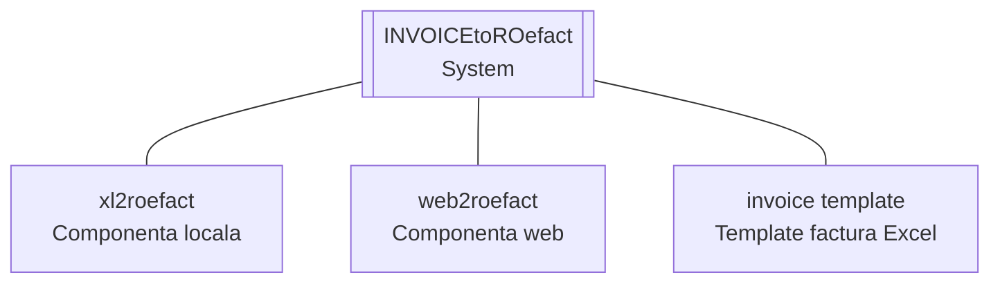

{ width="300" }

<small>**RENware Software Systems**</small>

# INVOICEtoROefact

**Facturi emise in Excel**, problema rezolvata cu **INVOICEtoROefact** !

Emiteti si folositi in continuare facturi in Excel. Acest sistem va produce fisierul XML de care aveti nevoie pentru sistemul [ANAF E-Factura](https://www.anaf.ro/anaf/internet/ANAF/despre_anaf/strategii_anaf/proiecte_digitalizare/e.factura).

Si mai mult, daca aveti nevoie, puteti Integra aceste facturi si alte sisteme externe prin metode moderne, uzuale, curente, incetatenite de ani de zile si binecunoscute de specialistii din IT.

## Componentele si facilitatile sistemului

Sistemul **INVOICEtoROefact** ofera urmatoarele componente:

* __xl2roefact__  - procesarea facturilor prin cod / program (development propriu)
    * [aplicatie linie comanda](./xl2roefact/README.md)
    * [biblioteca python dezvoltare](xl2roefact/doc/README_xl2roefact_library.md)

* __web2roefact__  - procesarea facturilor din interfara web  <!--#TODO link tbd -->

* __[invoice template](./excel_invoice_template/README.md)__  - model / sablon factura in Excel

[Descrierea facilitatilor acestor componente poate fi accessata aici](./doc_src/810-DSGN/810.05a-system_components.md).

## Date identificare

* p/n: `0000-0095`
* code-name: `api_to_roefact`
* commercial name: **INVOICEtoROefact**
* [site web](https://invoicetoroefact.renware.eu/)
* [Git Hub repository](https://github.com/petre-renware/api_to_roefact)
* [Git Hub releases](https://github.com/petre-renware/api_to_roefact/releases)
* copyright: RENware Software Systems
* author: Petre Iordanescu (petre.iordanescu@gmail.com)
* [general system license](./LICENSE.md "download")

