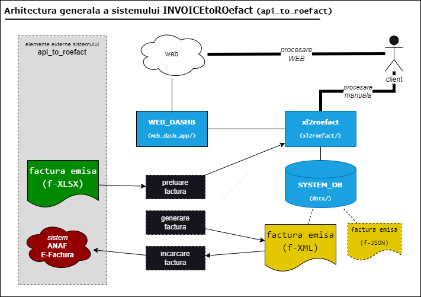
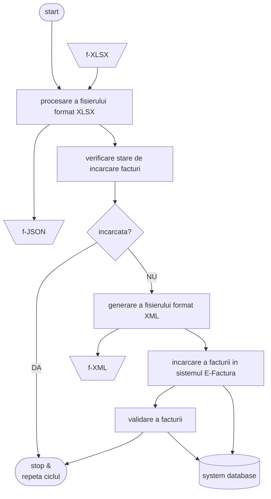

{ width="55" align=left }
<small markdown="1">**APItoROefact System** 
*(c) 2023 RENware Software Systems*
</small>  

# Propunere tehnica sistem APItoROefact

* p/n: `0000-0095`
* code-name: `api_to_roefact`
* commercial name: **APItoROefact**
* url propunere tehnica: `http://apitoroefact.renware.eu/commercial_agreement/110-SRE-api_to_roefact_requirements.html`
* git: `https://github.com/petre-renware/api_to_roefact`

***Cuprins:***

[TOC]

## Obiective

Acest sistem va asigura incarcarea facturilor emise in sistemul [ANAF E-Factura](https://www.anaf.ro/anaf/internet/ANAF/despre_anaf/strategii_anaf/proiecte_digitalizare/e.factura) cu respectarea reglementarilor publicate in acest sens (lista contine si legaturi catre fisierele publicate de catre ANAF):

* [Conformarea la modificarile legislative si utilizarea sistemului](https://static.anaf.ro/static/10/Anaf/Informatii_R/Informatii_modificare_CIUS_RO.pdf)

* [Informatii de interes referitoare la implementarea sistemului național privind factura electronică RO e-Factura](https://static.anaf.ro/static/10/Anaf/Informatii_R/Comunicat_e-factura_aprilie2022_v2_050422.pdf)

* [Instrucțiuni de utilizare](https://static.anaf.ro/static/10/Anaf/Informatii_R/API/Oauth_procedura_inregistrare_aplicatii_portal_ANAF.pdf)

## Vedere de ansamblu a solutiei

Solutia `api_to_roefact` consta din urmatoarele componente:

* `api_to_roefact`.**`xl2roefact`** aceasta componenta are rolul de a implementa efectiv obiectivele principale ale sistemului **APItoROefact**. Componenta este capabila sa ruleze atit "_standalone_" (ca linie de comanda CLI) dar si prin utilizarea ei de catre componenta `WEB_DASHB` si astfel utilizarea ei in varianta de sistem prezentat "_over internet / intranet_". [Prezentarea detalita a acesteia se gaseste aici](#componenta-xl2roefact).

* `api_to_roefact`.**`WEB_DASHB`** aceasta componenta are rolul de agrega componentele si de a prezenta solutia **APItoROefact** "_over internet / intranet_". De asemenea componenta asigura modulele UI necesare pentru administrarea sistemului. [Prezentarea detalita a acesteia se gaseste aici](#componenta-web_dashb).

* `api_to_roefact`.**`SYSTEM_DB`** .Aceasta componente reprezita baza de date a sistemului **APItoROefact** atit partea relationala dar si partea `no-sql` a acesteia (utilizata pentru eventuale sincrnizari provenite din utilizarea CLI a componentei `xl2roefact`). [Prezentarea detalita a acesteia se gaseste aici](#componenta-system_db).

Figura urmatoare prezinta schematic rolul general al componentelor precum si interactiunea acestora cu mediul exterior sistemului `api_to_roefact`.

## Componenta xl2roefact

* **(RDINV)** modul de procesare a fisierului format `XLSX` ce contine factura si colectare a datelor aferente
    * _INTRARI_: fisier format `XLSX` ce contine factura emisa (cod: **`f-XLSX`**)
    * _IESIRI_: fisier format `JSON` imagine a datelor facturii (cod: **`f-JSON`**)

* **(WRXML)** modul de generare a fisierului format `XML`
    * _INTRARI_: fisier `f-JSON`
    * _IESIRI_: fisier format `XML` conform cerintelor si sistemului `ANAF E-Factura` (cod: **`f-XML`**)

* **(CHKXML)** modul de validare a facturii in sistemul `ANAF E-Factura`
    * _INTRARI_: fisier `f-XML`
    * _IESIRI_: raport cu eventualele erori de validare [^1]

* **(LDXML)** modul de incarcare a facturii in sistemul `ANAF E-Factura`
    * _INTRARI_: fisier `f-XML`
    * _IESIRI_: raport cu validarea si identificatorul incarcarii [^1]

* **(CHKISLD)** modul de verificare a starii de incarcare a unei facturi emise
    * _INTRARI_: fisier `f-XLSX` sau numarul / cheia / codul facturii
    * _IESIRI_: valoarea echivalent `TRUE` daca factura a fost deja incarcata sau valoare echivalent `FALSE` daca factura nu a fost incarcata [^2]

!!! danger "Formatul fisierelor Excel cu factura"
    `XLSX` este sigurul format de fisier acceptat

### Diagrama logica de functionare a componentei

...#FIXME explicatii necesare ?...<!--#TODO -->

## Componenta WEB_DASHB<!--#TODO -->

...INCOMING... { width="150" } <!--#TODO -->

## Componenta SYSTEM_DB<!--#TODO -->

...INCOMING... { width="150" } <!--#TODO -->

<!-- #NOTE note generale / footnotes -->

[^1]: raportul se scrie in baza de date a sistemului si in fisierul `f-XLSX` intr-un worksheet separat dedicat acestui scop

[^2]: in cazul valorii echivalent `TRUE` se poate intoarce identificatorul incarcarii daca este disponibil

