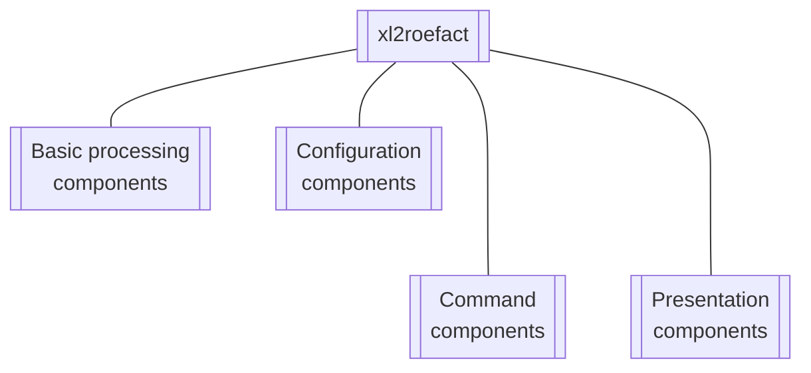

<!-- NOTE:
- This is the general technical design for `xl2roefact python library` component
- The DLD doc is a tech desc of every module, functions
-->


# Software development reference using xl2roefact python library


[TOC]


## Library components




### Basic processing components
These components assure the basic elementary-raw processing of information. Their interface is pure technical and require basic development knowledge to be used "as is".

* `rdinv` read an Excel file and extract invoice data to a JSON file format
* `wrxml`  write, convert the JSON invoice file to a XML file format, respecting schemes required by *RO EFact* standard
* `chkxml` check generated XML file
* `ldxml` load an invoice (ie, its XML associated file) to *ANAF SPV system*
* `chkisld` check if an invoice is already loaded in *ANAF SPV system*

### Command components
These components are 2nd level layer components desined to implement *user level functionalities*.

* `settings` manage system settings
* `xl2json` process Excel file and store extracted invoice data in JSON format. *[More detais here](./invoice_json_model_.md)*
* `json2xml` process JSON file and convert it to XML (ROeFact standard compliant)
* `json2pdf` process JSON file and produce invoice as PDF format
* `xml2roefact` upload XML format invoice to "SPV RO eFactura"

#### Session concept
This layer use the concept of **session data**, a session representing "all states & information" for a `Commands` class instance, from its creation until it is destroyed.

The concept allow to uses multiple commands (chain commands) in a session, without need of repeating / specifying parameters send to last command process. This is useful to avoid re-requesting end users for parametrs entry in a *web application* or *console session application* (ie, start command and execute multimple commands at a dedicated prompt until a "quit" or similar command).

#### Layer organization
This layer consist of the following clases:

* `CommandResult` is a dataclass aimed to contain resulted information from commands processing. It contains all needed information in order to be able to render and display it as plain text, rich / enenhanced text or HTML. It contains:
    * *status code* (HTTP standard codes)
    * *status short text* as "human representation of status code", *console output* (plain text & HTML)
    * *effective information*
resulted from command processing.

* `SessionDataType` is a dataclass containg all potential parameters passed to commands and which are subject to be repeated in the same session (to avoid re-entering them by end users and to present them as proposed default values)

* `Commands` is the final class containing effective methods and session data

For more details see below the *API Reference* section.


### Configuration components
These are the components that assure and make possible system configurablitity at user level.

* `config_settings` *USER level* configuration - define application settings & parameters mainly used in invoice info / data detection and extract from invoice Excel format file
* `sys_settings` *SYSTEM level* configuration - system database and parameters, not changeable at user level in current application usage (changing these parameters needs code updating to make them effective) - details in section [Sysyem database and parameters](#sysyem-database-and-parameters)

### Presentation components
These are 2nd level layer components that make sysyem usable in various forms such as command line console application, daemon / server that runs in background and can be called from local or remote clients, library interfaces (for extensions and custom development) that hide low level technical execution details.

* `app_cli` contains the code for `xl2roefact` application command line (CLI) format
* `__main__` assures right package "addressing" as Python modele (ie, running as `python -m xl2roefact ...`)
* `__version__` keeps current system version and helper functions to assure standard and canonical representation of version string
* `__init__` assure friendly exposing of system public objects (and of course classic pytgon role of "package maker")


## Install library
Library can be installed using 2 methods:

* install from PyPi
* install from site archive of distribution packages

### Install from PyPi
The library installation can be done using standard Python instruments:

```bash
pip install xl2roefact
```

This command will install by default the last stable version. For other versions, standard PyPi procedure to  install a specific version must be used.


### Install from distribution packages
To install from distribution packages first download the package version intended to install ([see download section](#download-xl2roefact-library)), choose the package type (if you have no special option, then choose *`WHEEL`* format) and install it using `pip` as any other Python library installation (*detailed in Python official documentation*).


## Aspecte tehnice referitoare la formatul fisierului JSON aferent facturii
Acest fisier este cel generat de catre aplicatie in urma executiei acesteia cu comanda `xl2json`. Structura de baza a acestui fisier este:


```json
{
    "Invoice": {...},
    "meta_info": {...},
    "excel_original_data": {...}
}

```

Cheile de la primul nivel contin:

* **`Invoice`** - datele efective ale facturii
* **`meta_info`**
    * informatii referitoare la procesarea facturii si mapa de conversie a cheii `Invoice` din formatul `JSON` in formatul `XML` cerut de sistemul *RO E-Fact*
    * harta de ajutor in conversia formatului JSON in formatul XML acceptat de sistemul RO E-Fact (cheie `meta_info.map_JSONkeys_XMLtags`) si definititiile XML aferente (cheie `meta_info.invoice_XML_schemes`)
    * alte informatii despre fisierul Excel prelucrat (numele, worksheet cu factura, data si ora procesarii, CRC pentru verificare, etc)
* **`excel_original_data`** - informatiile originale din fisierul Excel, asa cum au fost ele identificate si gasite precum si locatia (adresele celulelor). Aceste informatii sunt utile in cazul in care exista neclaritati in urma procesuluicde conversie pentru "a intelege" de unde si cum arata informatiile originale din fisierul Excel


An [example of JSON generated file is available here](./invoice_json_model_.md)


## Sysyem database and parameters
System database is an object that interface library components with physical stores of parameters and data requred by system and its applications.

Sometimes it can contain both physical and logical interfaces one example being *InvoiceTypes*  which consists of:

* `InvoiceTypes: dict` the physical store of invoice types name and codes
* `InvoiceTypesEnum: Enum` the logical object with invoice types implemented as standard Python enumeration (`enum`)

This let open the possibility that in future versions to "externalize" physical data-objects to other systems or distinct files, but letting small / tinny physical data-objects to stay in `sys_settings.py` module.


## [API Refrence](https://invoicetoroefact.renware.eu/xl2roefact/doc/wrapper_810.05a-xl2roefact_DLD_specs.html)

<!--NOTE: reference using in-profect document
[API Reference](./wrapper_810.05a-xl2roefact_DLD_specs.md)
-->


## Download xl2roefact library

* [Pachete instalare biblioteca Python formate WHEEL si DIST](../../doc_src/downloads.md#format-biblioteca-python)


